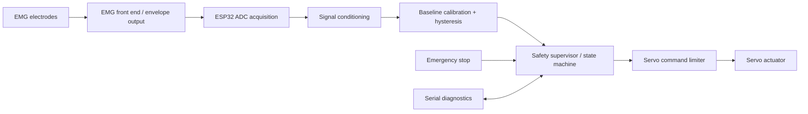

# NeuroFlex — EMG-Controlled Bionic Hand

<p align="center">
  <strong>Embedded control · Surface EMG · Robotics · 3D-printed mechanisms</strong>
</p>

<p align="center">
  
  
  
  
</p>

NeuroFlex is an embedded-control reference implementation for an EMG-driven bionic-hand research prototype. It separates signal acquisition, calibration, activation detection, actuator control, safety supervision, and serial diagnostics into small modules.

**Target profile:** ESP32 using the Arduino framework, an analog EMG module that provides a conditioned amplitude/envelope output, and a hobby servo. The defaults are an example profile and must be checked against the actual hardware before powering actuators.

> **Safety and scope:** This is an educational/research prototype, not a certified medical device or clinically validated prosthesis. Do not use it as a medical device or rely on it for safety-critical tasks. Do not connect a person to non-isolated mains-powered electronics. Follow the EMG manufacturer's electrode and electrical-safety instructions. Bench-test with actuator power disconnected first, then test unloaded with safe mechanical limits and an accessible power disconnect.

## Features

- Modular ESP32 firmware with explicit operating states
- ADC sampling at a configured interval, smoothed envelope reading, and hysteresis-based activation
- Startup calibration using relaxed baseline samples
- Configurable open/close positions and rate-limited servo movement
- Sensor range and stale-signal checks
- Hardware emergency-stop input and serial `STOP` / `ARM` commands
- Watchdog-friendly non-blocking main loop
- Serial telemetry and configuration summary
- PlatformIO build configuration, unit-testable core logic, CI workflow, and hardware documentation templates

## Architecture



## Repository layout

```text
.
├── firmware/
│   ├── include/          # configuration and controller interfaces
│   ├── src/              # firmware modules
│   ├── test/             # host-side unit tests
│   └── platformio.ini
├── hardware/             # BOM, wiring, power design and bring-up checklist
├── mechanical/           # STL model and print/assembly notes
├── docs/                 # architecture, calibration, safety and validation
├── media/                # prototype photos and demonstration links
└── .github/workflows/    # CI build
```

## Quick start

1. Read `hardware/SAFETY_AND_BRINGUP.md`, `hardware/WIRING.md`, and `hardware/POWER.md`.
2. Confirm the exact EMG module output type and ESP32 board variant.
3. Install [PlatformIO Core](https://platformio.org/install/cli) or the PlatformIO IDE extension.
4. Review `firmware/include/config.h` and update pins, ADC assumptions, actuator range, calibration settings, and safety input polarity.
5. Build: `cd firmware && pio run`
6. Flash only after reviewing wiring and safety checks: `pio run --target upload`
7. Open serial monitor: `pio device monitor -b 115200`

**Do not upload this firmware unchanged to unknown hardware.** ESP32 variants have different ADC capabilities and pin restrictions. GPIO defaults are examples, not a verified pinout for your prototype.

## Serial interface

Commands are line-based and case-insensitive:
- `STATUS` — current state and signal values
- `HELP` — command list
- `STOP` — latch software stop
- `ARM` — request arming after safety checks pass
- `CALIBRATE` — restart relaxed-baseline calibration
- `OPEN` / `CLOSE` — manual position request while armed (for bench testing only)

The physical emergency-stop input always takes priority. `ARM` does not bypass calibration, sensor validity, or emergency-stop checks.

## Operating states

- `BOOT`: initialize hardware and report configuration
- `CALIBRATING`: collect relaxed baseline; actuator stays at open position
- `DISARMED`: signal is monitored, actuator commands are not applied
- `ARMED`: EMG activation may control the actuator
- `STOPPED`: output is held at the configured safe/open position; explicit reset and re-arm are required

## Important hardware assumptions

This reference build expects an **analog envelope/amplitude output**, not an arbitrary raw bipolar EMG signal. If your module outputs raw EMG, use its datasheet to design a proper analog front end and appropriate filtering before ADC acquisition. The included moving average and threshold detector are intentionally simple and are not a substitute for a validated raw-EMG pipeline.

See `hardware/BOM.md` for items to fill in and `docs/VALIDATION_PLAN.md` for bench acceptance tests. Replace placeholders with measured values; do not invent performance claims.

## License

MIT for this repository's software and documentation. Third-party components, data, and any added CAD/media remain subject to their own licenses.
